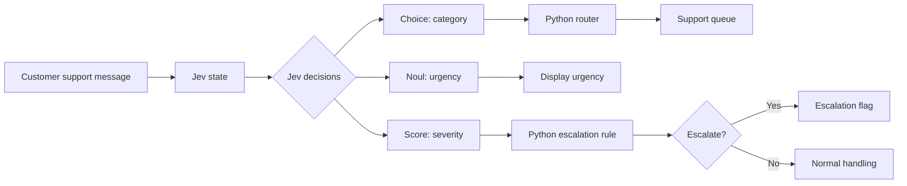
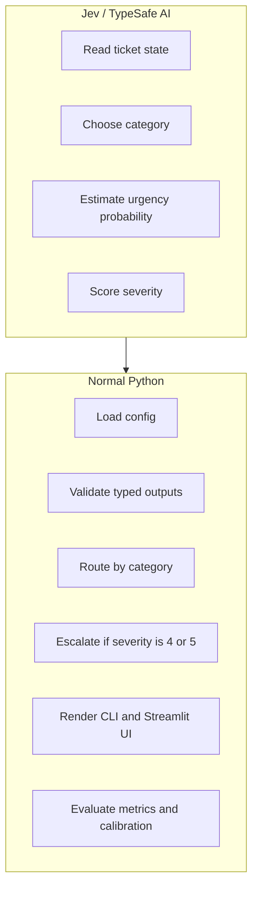
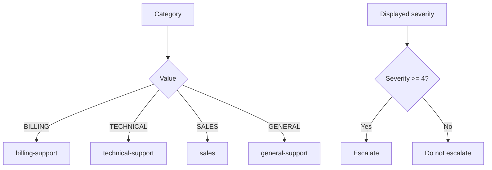
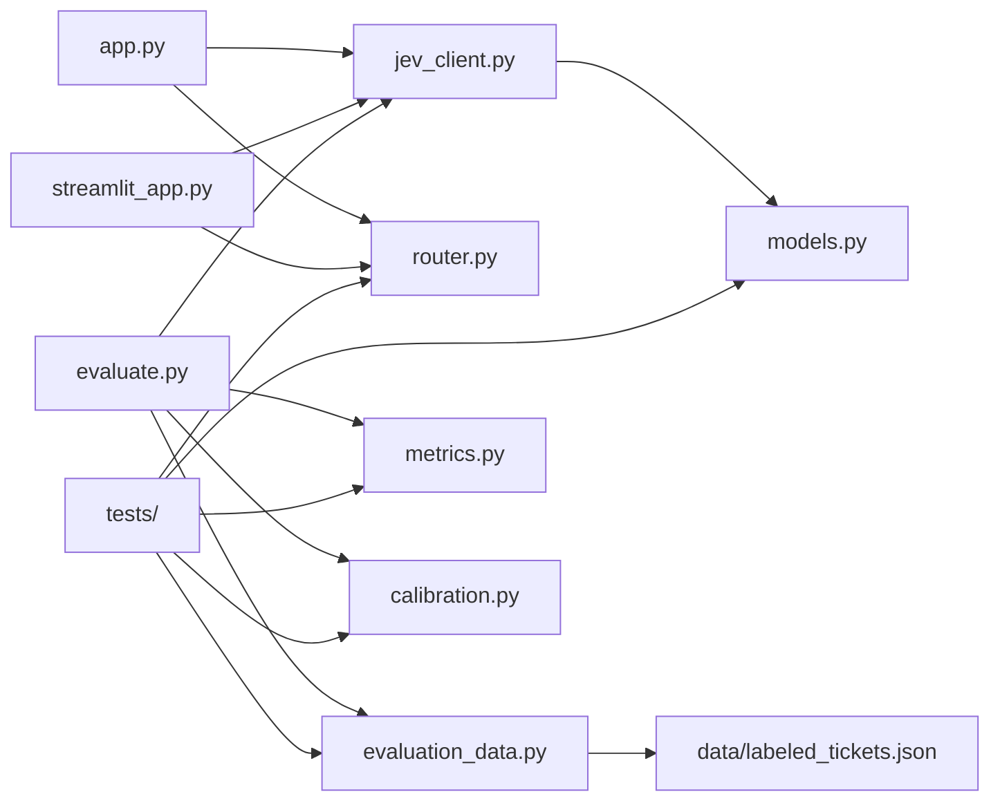
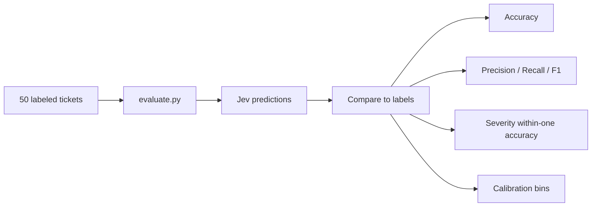
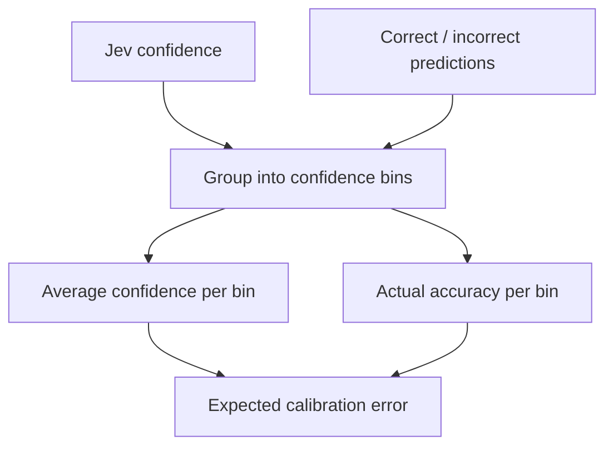

# JevTicket

JevTicket is a learning project for building a support-ticket decision router with **Jev by TypeSafe AI**.

It takes a customer-support message, asks Jev for typed decisions, then uses normal Python code to route and escalate the ticket.

## App Flow



## Responsibility Split



## Decisions

| Decision | Jev type | Output | Used for |
| --- | --- | --- | --- |
| Category | `Choice` | `BILLING`, `TECHNICAL`, `SALES`, `GENERAL` | Routing |
| Urgency | `Noul` | probability from `0` to `1` | Displaying urgent `YES` or `NO` |
| Severity | `Score` | level converted to `1..5` | Escalation |

## Routing Rules



## Project Map



## File Guide

| File | Purpose |
| --- | --- |
| `app.py` | Terminal demo app |
| `streamlit_app.py` | Streamlit UI |
| `jev_client.py` | TypeSafe SDK integration |
| `models.py` | Categories, severity rubric, typed decision model |
| `router.py` | Deterministic category routing and escalation |
| `data/labeled_tickets.json` | 50 labeled examples |
| `evaluate.py` | Runs Jev on the labeled dataset |
| `metrics.py` | Accuracy, precision, recall, F1 |
| `calibration.py` | Calibration bins and expected calibration error |
| `tests/` | Unit tests |

## Setup

Create and activate a virtual environment:

```powershell
python -m venv .venv
.\.venv\Scripts\Activate.ps1
```

Install dependencies:

```powershell
python -m pip install -r requirements.txt
```

Create a `.env` file from `.env.example`:

```text
TYPESAFE_API_KEY=your_typesafe_api_key_here
```

Never commit `.env`; it is ignored by `.gitignore`.

## Run The App

Terminal version:

```powershell
python app.py
```

Streamlit UI:

```powershell
python -m streamlit run streamlit_app.py
```

Expected output shape:

```text
Input:
Payment was deducted twice from my account.

Ticket Analysis
Category: BILLING
Urgent: NO
Urgency probability: 0.1234
Severity: 4 / 5

Routing Decision
Team: Billing
Queue: billing-support
Escalate: YES
Route to the billing support team.
```

## Evaluation Flow



Run the full labeled evaluation:

```powershell
python evaluate.py
```

Run a smaller smoke evaluation:

```powershell
python evaluate.py --limit 5
```

The evaluator reports metrics for:

- category
- urgency
- severity
- escalation
- severity within-one accuracy
- confidence calibration

## Calibration

Calibration asks:

```text
When Jev says it is about 80% confident, is it correct about 80% of the time?
```



Lower expected calibration error is better. With only 50 tickets, treat this as a learning diagnostic rather than a final benchmark.

## Tests

Run all tests:

```powershell
python -m unittest discover
```

The tests cover routing, models, labeled data, metrics, and calibration.

## Notes

- Jev is in early access and requires a TypeSafe API key.
- The official Python package used here is `typesafe-sdk`.
- The app uses `TYPESAFE_API_KEY` and `TYPESAFE_DEFAULT_MODEL`.
- The TypeSafe SDK reports `Score` levels as zero-based indexes; this project converts them to the learning scale `1..5`.
