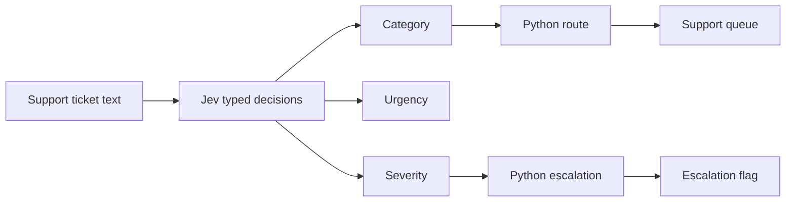
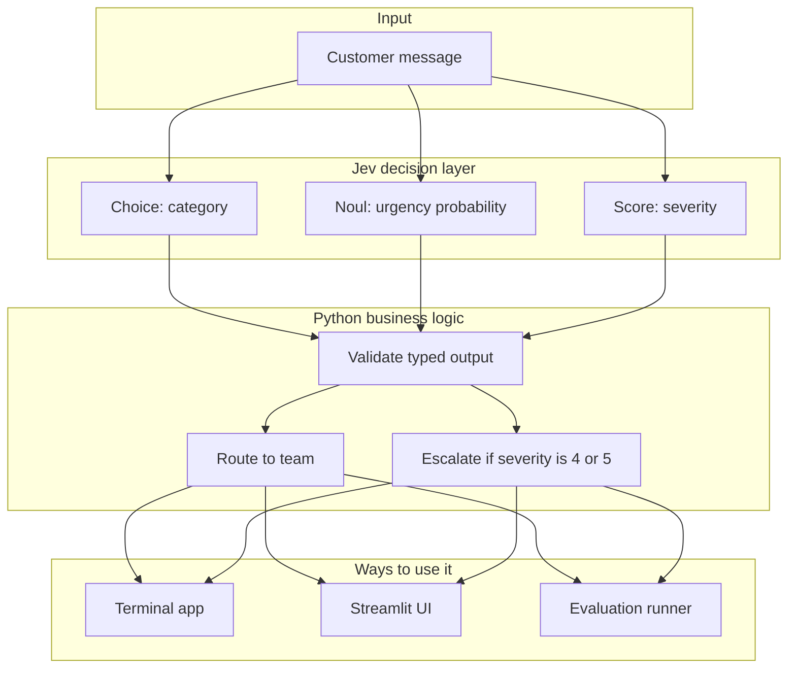
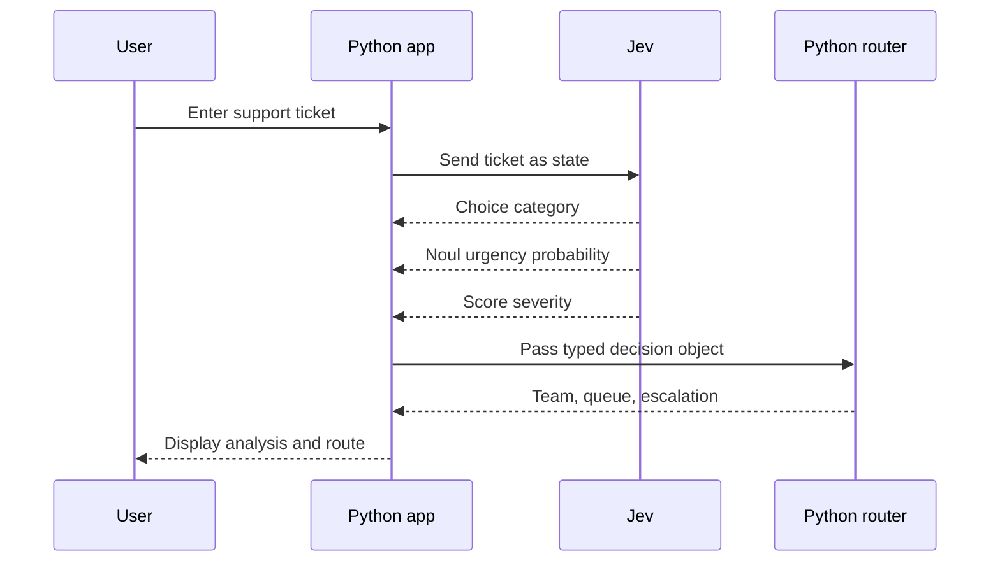
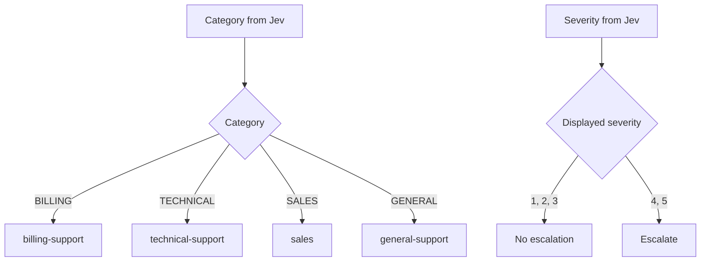
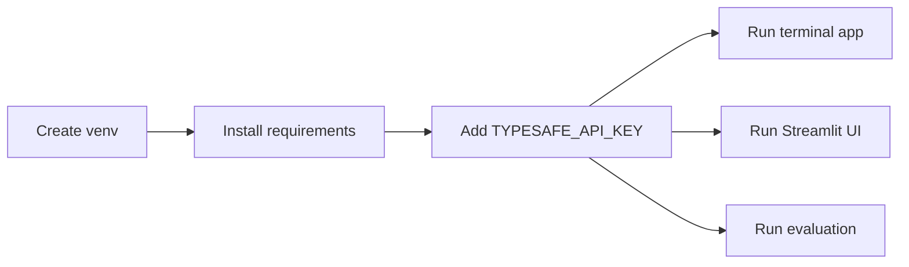
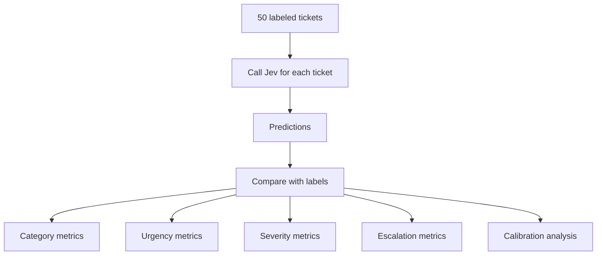
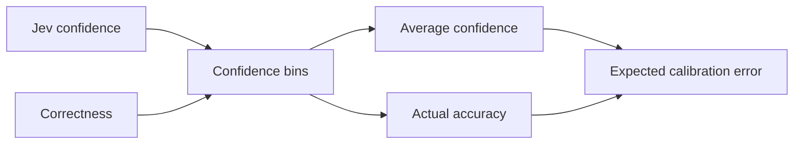
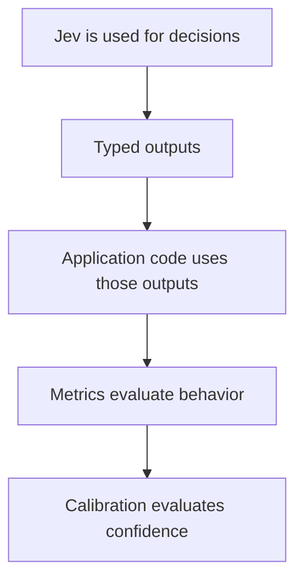

# JevTicket

Visual learning project for building a **Jev by TypeSafe AI** support-ticket router.



## Big Picture



## Decision Flow



## Jev Decisions

| Question | Jev type | Example output | Meaning |
| --- | --- | --- | --- |
| Which team should handle this? | `Choice` | `BILLING` | One label from a fixed list |
| Is it urgent? | `Noul` | `0.82` | Probability of yes |
| How severe is it? | `Score` | `4 / 5` | Ordered severity level |

## Routing Flow



## Project Map


## Files At A Glance

| File | Role |
| --- | --- |
| `app.py` | Terminal demo |
| `streamlit_app.py` | Browser UI |
| `jev_client.py` | TypeSafe SDK and Jev questions |
| `models.py` | Typed categories, severity rubric, decision model |
| `router.py` | Team routing and escalation rule |
| `evaluate.py` | Runs labeled evaluation |
| `metrics.py` | Accuracy, precision, recall, F1 |
| `calibration.py` | Confidence calibration |
| `data/labeled_tickets.json` | 50 labeled examples |
| `tests/` | Unit tests |

## Quick Start



Create and activate a virtual environment:

```powershell
python -m venv .venv
.\.venv\Scripts\Activate.ps1
```

Install dependencies:

```powershell
python -m pip install -r requirements.txt
```

Create `.env`:

```text
TYPESAFE_API_KEY=your_typesafe_api_key_here
```

## Run

| Use case | Command |
| --- | --- |
| Terminal demo | `python app.py` |
| Streamlit UI | `python -m streamlit run streamlit_app.py` |
| Full evaluation | `python evaluate.py` |
| Small evaluation smoke test | `python evaluate.py --limit 5` |
| Unit tests | `python -m unittest discover` |

## Example Output

```text
Input:
Payment was deducted twice from my account.

Ticket Analysis
Category: BILLING
Urgent: NO
Urgency probability: 0.1234
Severity: 4 / 5

Routing Decision
Team: Billing
Queue: billing-support
Escalate: YES
Route to the billing support team.
```

## Evaluation Flow



Metrics reported:

| Area | Metrics |
| --- | --- |
| Category | accuracy, precision, recall, F1 |
| Urgency | accuracy, precision, recall, F1 |
| Severity | accuracy, precision, recall, F1, within-one accuracy |
| Escalation | accuracy, precision, recall, F1 |
| Confidence | calibration bins, expected calibration error |

## Calibration Flow



Calibration asks whether confidence matches reality. If Jev is about `80%` confident, a well-calibrated system should be correct about `80%` of the time in that bin.

## Learning Notes



- Jev decisions are typed: `Choice`, `Noul`, and `Score`.
- Python does the deterministic routing and escalation.
- `.env` stores the TypeSafe API key and must not be committed.
- The TypeSafe SDK reports `Score` indexes as `0..4`; this project converts them to `1..5`.
- The 50 labeled tickets are for evaluation, not training.
